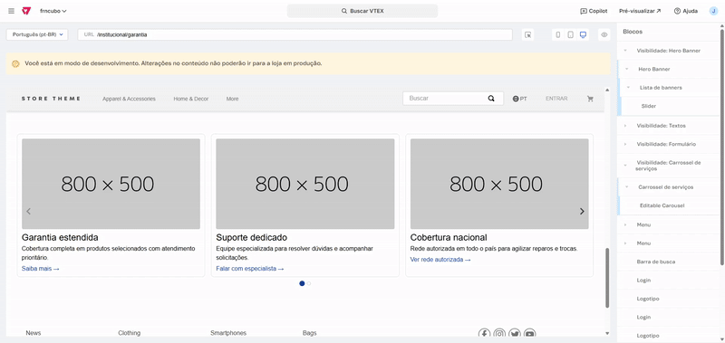
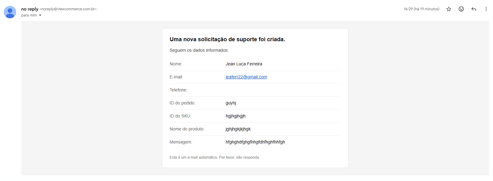

# Formulário de Reporte de Produto (VTEX IO)

Aplicação VTEX IO com bloco `product-report-form` que envia relatos de problemas de produtos para o Master Data v1 via rota Node (`/_v/save-product-report`). Abaixo, instruções de instalação, cadastro da entidade e configuração de notificação.

## Instalação e `vtex link`
- Pré‑requisitos: Conta/loja, workspace de desenvolvimento ativo, Node 16+ e Yarn.
- Clone o projeto e instale as dependências locais (opcional, apenas para edição de estilos): `yarn`.
- Faça login e selecione o workspace: `vtex login {account}` → `vtex use {workspace}`.
- Link da app na loja: na raiz do projeto, rode `vtex link`.

## Criação da entidade PR no Master Data v1 (conceitual)
1. No Admin: Master Data v1 → Data Entities → "New".
2. Crie a entidade com acrônimo **PR** e nome "Product Report".
3. Defina os campos:
   - `clientName` (required, formato Varchar 100)
   - `email` (required, formato Email)
   - `phone` (opcional, formato Varchar 50)
   - `orderId` (required, formato Text)
   - `skuId` (required, formato Text)
   - `productName` (opcional, formato Text)
   - `message` (required, formato Text)
4. Publique a entidade.

## Configuração de Trigger + Email (conceitual)
1. Em Master Data v1 → Trigger → "Add New":
   - Data entity: `Product Report (PR)`
   - Rules: `A record is created`
   - If Positive: "Send an email", adicione o e-mail que receberá nos e-mails estáticos e configure a mensagem (HTML ou Text).
2. Salve e teste criando um documento em `PR` para validar o disparo do email.

## Decisões técnicas
- Front-end (React): campos obrigatórios marcados com `required`, normalização de telefone (`formatPhone`), trim antes do envio e feedback por estados `loading`, `success`, `error` com `Alert` do Styleguide.
- Back-end (Node): rota pública `/_v/save-product-report` valida campos obrigatórios, responde erros claros e cria documento na entidade `PR` via client de Master Data.

## Evidências visuais
- Fluxo completo do formulário na loja:  
  
- Configuração do bloco no Site Editor do editable carousel:  
  
- E-mail recebido após a criação do registro:  
  
